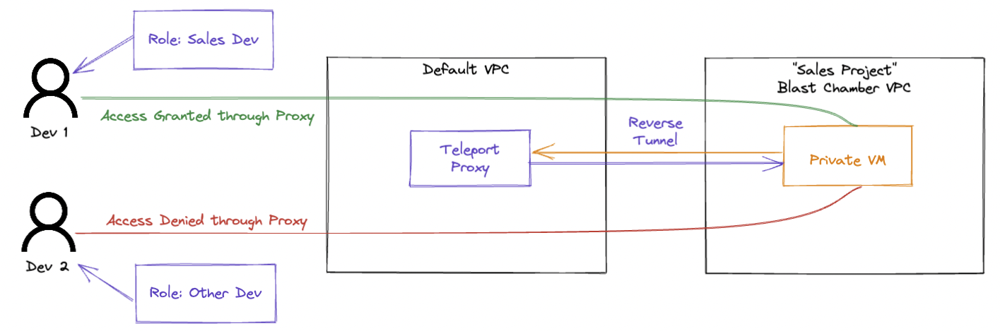

# 90COS-teleport-demo

## About
Repository generates a testing instance of Teleport + associated components for a quick demonstration of reverse tunnel connectivity between a private EC2 instance and the Teleport proxy service.

- Creates an EKS instance with a Teleport Cluster deployed
- Creates a testing VPC to mimic the blast chamber with public and private subnets
- Creates Amazon Linux private EC2 instance in blast chamber VPC serving as the Teleport agent
    - Terraform configures the private instance to connect with Teleport

## Instructions

1. Run EKS cluster
    ```
    eksctl create cluster -f ./eksctl/eks_config.yaml
    ```
    Add aws-auth if desired, changing the role name to match the eksctl generated cluster service role
    
2. Run terraform to create Teleport policies and attach to newly created cluster
    
    From `./terraform/create-teleport-policies`
    ```
    terraform init
    terraform apply -var="eks_node_group_role=<role name from EKS creation>"
    ```
    
3. Add certificate secret in cluster (certs not included)
    ```
    kubectl create ns teleport
    kubectl create secret tls -n teleport tls-secret --key="./certs/privkey.pem" --cert="./certs/fullchain.pem”
    ```
    
4. Run Teleport helm chart to deploy the application in the EKS cluster
    
    ```
    helm upgrade --install teleport teleport/teleport-cluster -f ./teleport/values.yaml --create-namespace -n teleport
    ```
    
5. Get AWS domain from Teleport load balancer and copy to DNS CNAME
6. In Teleport node shell, create users, roles, token
    
    From auth cluster shell:
    ```
    tctl users add admin --roles=editor,auditor,access --logins=root,ubuntu,ec2-user
    ```
    
    From local:
    ```
    tsh login --proxy=teleport.<example>.com --user=admin
    tctl status
    ```
    
    From `./teleport/resources`
    ```
    ./create-resources.sh
    ```

7. Run terraform to create test VPC and private boxes 
    
    From `./terraform/create-test-resources`
    ```
    terraform init
    terraform apply
    ```

    Note - Uses “user data” to install teleport and connect to cluster, see following files to debug user data scripts
    - /var/log/cloud-init.log
    - /var/log/cloud-init-output.log